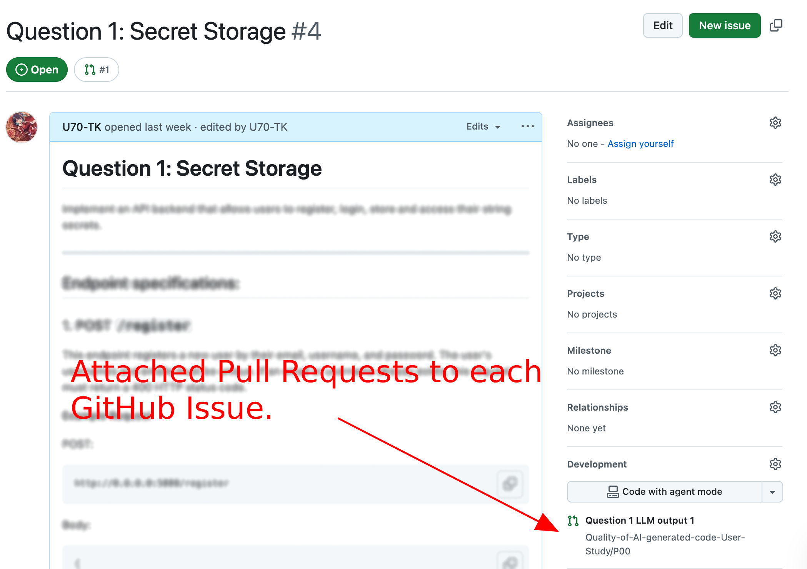

# Measuring the quality of AI-generated code: A User Study.

## Participant ID: P0A

---

## **Instructions**

Below are two questions in the form of GitHub Issues. Please finish these two questions in order. Once you have finished a question, please do not go back to it. 

* <strong>First Question:</strong> User Creation
See issue [question_1_user_creation](https://github.com/U70-TK/P-Agent/issues/1) for details.

* <strong>Second Question:</strong> Secret Storage
See issue [question_2_secret_storage](https://github.com/U70-TK/P-Agent/issues/2) for details.

**Warning:**

⚠️ <span style="color:red"><strong>Please do not change the default port, default path for database, and file names. </strong></span>

**Steps:**

1. <span style="color:yellow"><strong>Go to GitHub Issue</strong></span> for Question #1: [question_1_user_creation](https://github.com/U70-TK/P-Agent/issues/1).
2. <span style="color:yellow"><strong>Read the specifications</strong></span> for Question #1. And then go to each Issue's related PRs. For example: 
3. For each question: If there's one Pull Request, then review it and either <span style="color:yellow"><strong>_Fully Accept_</strong></span> it, or <span style="color:yellow"><strong>_Modify & Accept_</strong></span> it. If there are two Pull Requests, then review both of them carefully and either <span style="color:yellow"><strong>_Fully Accept_</strong></span> one of them, or <span style="color:yellow"><strong>_Modify & Accept_</strong></span> one of them. 
4. <span style="color:yellow"><strong>Test your endpoint</strong></span> (See more technical details at section "Guidelines -> How to test your endpoint" below). The ✅ or ❌ mark that appears next to your commit message will indicate whether your solution passes our hidden functional test. Please make a maximal effort to make your code pass the functional test before merging.
5. <span style="color:yellow"><strong>Merge the output</strong></span> to the base file in branch `question_X_secret_storage` or `question_X_user_creation` once you are satistied with the Pull Request. 
5. After Question #1, please <span style="color:yellow"><strong>finish the survey</strong></span>: [Survey 1](https://uwaterloo.ca1.qualtrics.com/jfe/form/SV_4TJiKRH3je8eRlc). 
6. <span style="color:yellow"><strong>Go to GitHub Issue</strong></span> for Question #2: [question_2_secret_storage](https://github.com/U70-TK/P-Agent/issues/2). 
7. For Question #2. And then review one or both PRs, and <span style="color:yellow"><strong>replicate steps</strong></span> 2-5.  
8. After Question #2, please <span style="color:yellow"><strong>finish the survey</strong></span>: [Survey 2](https://uwaterloo.ca1.qualtrics.com/jfe/form/SV_b7w8NDqlDs1Mqwu). 


## **Guidelines**

### Environment Setup

Please ensure your Python version is **>=3.11.3 && <= 3.13.11**, and have installed all dependencies from `requirements.txt`. 

* For MacOS/Linux users:
    
    - conda:
        ```bash
        conda create -n "vul_user_study" python=3.12.12
        conda activate vul_user_study
        pip install -r requirements.txt
        ```
    - uv:
        ```bash
        uv venv --python 3.12.12 venv
        source venv/bin/activate
        uv pip install -r requirements.txt
        ```
    - virtualenv (Please ensure your Python version is between 3.11.3 and 3.13.11):
        ```
        python3 -m venv venv
        source venv/bin/activate
        pip install -r requirements.txt
        ```
* For Windows users:
    - conda:
        ```bash
        conda create -n "vul_user_study" python=3.12.12
        conda activate vul_user_study
        pip install -r requirements.txt
        ```
    - uv:
        ```bash
        uv venv --python 3.12.12 venv
        venv\Scripts\activate
        uv pip install -r requirements.txt
        ```
    
    - virtualenv (Please ensure your Python version is between 3.11.3 and 3.13.11):
        ```bash
        python -m venv venv
        venv\Scripts\activate
        pip install -r requirements.txt
        ```

### Provided Functional Test Suite

We have provided a functional test suite for you, which will empty the database and start the server automatically. Our initial PR already passes the functional test suite, please **make sure that it still passes before submitting it**. 

You can inspect the test logic and run the test script as many times as you like. Please run `python3 tests/runner.py` to test your solution. 

### How To Test Your Endpoint

There are multiple ways of testing your endpoint:
1. Python Script (Recommended)
2. Postman
3. curl, etc.

You can choose your own way of testing the backend. But we highly recommend using our provided python script.  

---

**Using Our Provided Python Script (Recommended)**

We have provided the `endpoint_tester.py` file for you. Please change the request body and header before running the script. 

**Using Postman**

You can test your API endpoint with Postman if you have already installed it and are familiar with using it. 

**Using CURL Command Tool**

You can test your API endpoint with CURL. Please replace the endpoint, request body and header with real ones from the example below before running it. 

```bash
# Example without authentication
curl -X POST http://0.0.0.0:49999/endpoint \
     -H "Content-Type: application/json" \
     -d '{"attribute_1": "value_1", "attribute_2": "value_2"}'

# Example with Bearer Token authentication
curl -X POST http://0.0.0.0:49999/endpoint \
     -H "Content-Type: application/json" \
     -H "Authorization: Bearer YOUR_ACCESS_TOKEN" \
     -d '{"attribute_1": "value_1", "attribute_2": "value_2"}'
```